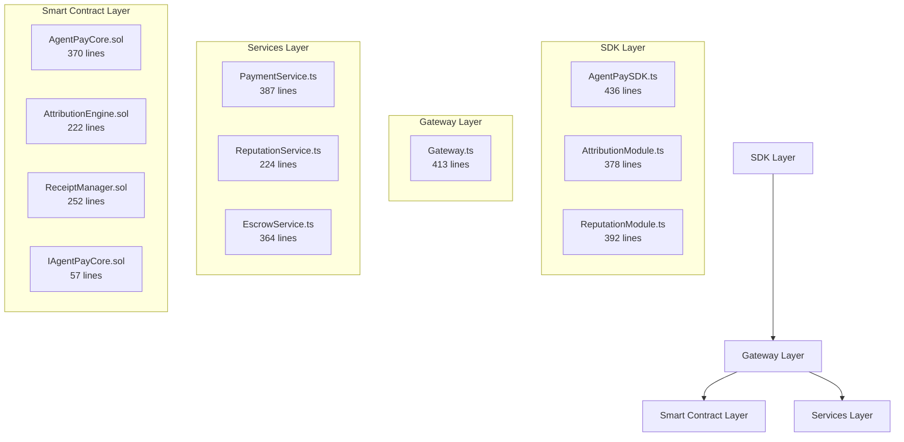
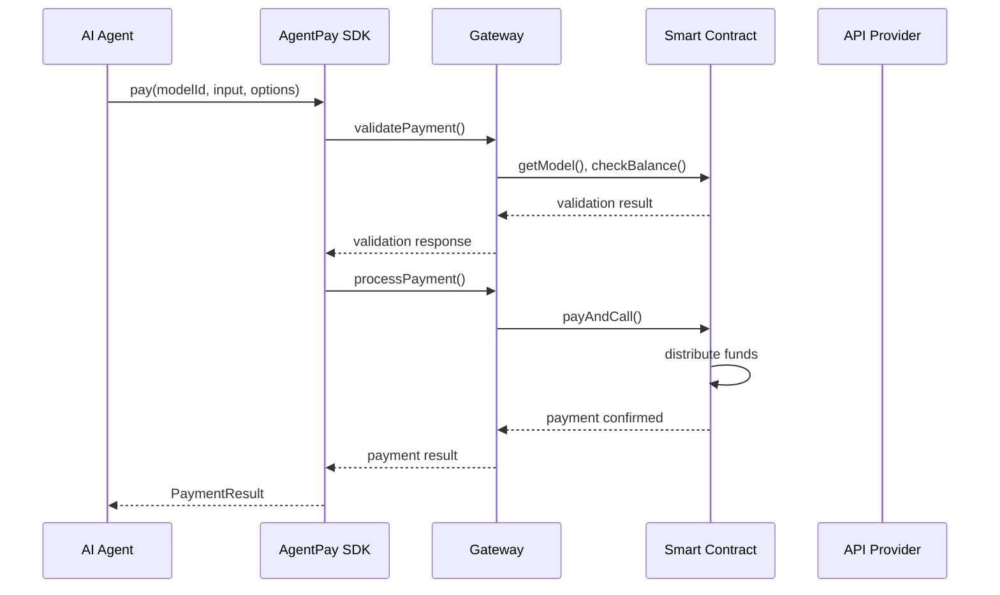
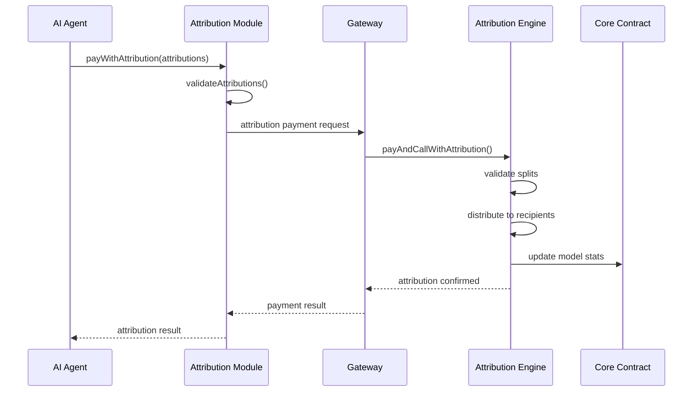

# AgentPay Architecture Documentation

**Version**: 2.0.0  
**Last Updated**: January 2025  
**Author**: AgentPay Team

## 🏗️ **Architecture Overview**

AgentPay is a modular, enterprise-grade payment infrastructure for AI agents built on multiple blockchain networks. The system consists of four main layers:



## 📁 **Code Organization**

### **File Size Compliance** ✅
All files are under 450 lines for maximum maintainability:

| Component | File | Lines | Status |
|-----------|------|-------|--------|
| **Smart Contracts** | | | |
| Core Interface | `IAgentPayCore.sol` | 57 | ✅ |
| Attribution Engine | `AttributionEngine.sol` | 222 | ✅ |
| Receipt Manager | `ReceiptManager.sol` | 252 | ✅ |
| Core Contract | `AgentPayCore.sol` | 370 | ✅ |
| **Gateway Services** | | | |
| Main Gateway | `Gateway.ts` | 413 | ✅ |
| Payment Service | `PaymentService.ts` | 387 | ✅ |
| Reputation Service | `ReputationService.ts` | 224 | ✅ |
| Escrow Service | `EscrowService.ts` | 364 | ✅ |
| **SDK Modules** | | | |
| Main SDK | `AgentPaySDK.ts` | 436 | ✅ |
| Attribution Module | `AttributionModule.ts` | 378 | ✅ |
| Reputation Module | `ReputationModule.ts` | 392 | ✅ |

---

## 🎯 **Layer Responsibilities**

### **1. Smart Contract Layer**
- **Purpose**: On-chain payment processing, attribution, and verification
- **Networks**: Ethereum, Polygon, Arbitrum, Optimism, Base
- **Key Features**:
  - Multi-party revenue attribution
  - Cryptographic receipt verification  
  - Balance management (prepaid + earnings)
  - Platform fee collection

### **2. Gateway Layer**
- **Purpose**: Off-chain orchestration and API management
- **Key Features**:
  - Payment validation and processing
  - Real-time analytics and monitoring
  - Agent reputation tracking
  - Task escrow management
  - Multi-network support

### **3. Services Layer**
- **Purpose**: Specialized business logic modules
- **Components**:
  - **PaymentService**: Blockchain interaction, validation
  - **ReputationService**: Agent scoring, leaderboards
  - **EscrowService**: Task-based payments, custom modules

### **4. SDK Layer**
- **Purpose**: Developer-friendly interface
- **Components**:
  - **AgentPaySDK**: Main payment and wallet functionality
  - **AttributionModule**: Multi-party revenue splits
  - **ReputationModule**: Agent discovery and reliability

---

## 🔄 **Data Flow**

### **Basic Payment Flow**


### **Attribution Payment Flow**


---

## 🛡️ **Security Model**

### **Smart Contract Security**
- **Reentrancy Protection**: All state-changing functions use OpenZeppelin's ReentrancyGuard
- **Access Control**: Ownable pattern with role-based permissions
- **Input Validation**: Comprehensive parameter checking and bounds validation
- **Signature Verification**: EIP-712 compliant signature validation for gasless transactions

### **Gateway Security**
- **Rate Limiting**: Express rate limiter (100 requests/15 minutes)
- **CORS Protection**: Configurable origin allowlist
- **Input Sanitization**: JSON schema validation on all endpoints
- **Error Handling**: Secure error messages without sensitive data exposure

### **Attribution Security**
- **Split Validation**: Ensures attributions sum to exactly 100%
- **Address Verification**: Validates all recipient addresses
- **Replay Protection**: Unique payment IDs prevent double-spending
- **Maximum Recipients**: Limited to 10 recipients per attribution

---

## 🔗 **Integration Patterns**

### **Basic Integration** (Simple Payments)
```typescript
import { AgentPaySDK } from '@agentpay/sdk';

const agentpay = new AgentPaySDK('https://gateway.agentpay.org');
await agentpay.generateWallet();

// Simple payment
const result = await agentpay.pay('gpt-4', 
  { query: 'Analyze market trends' }, 
  { price: '0.05', mock: false }
);
```

### **Advanced Integration** (Attribution + Reputation)
```typescript
// Multi-agent workflow with attribution
const attributions = agentpay.attribution.createPatternAttributions(
  'data-heavy',
  { 
    dataAgent: '0x123...', 
    analysisAgent: '0x456...' 
  }
);

const result = await agentpay.pay('complex-analysis', input, {
  price: '0.25',
  attributions
});

// Agent discovery
const specialists = await agentpay.reputation.findAgentsBySpecialty(
  'financial-analysis', 
  4.0 // min rating
);
```

### **Enterprise Integration** (Full Features)
```typescript
// Task-based escrow
const task = await fetch('http://gateway/tasks', {
  method: 'POST',
  body: JSON.stringify({
    payer: wallet.address,
    worker: selectedAgent.address,
    amount: '1.00',
    escrowType: 'hash',
    rules: { expectedHash: '0xabc...' }
  })
});

// Reputation monitoring
const reliability = await agentpay.reputation.checkReliability(
  agent.address, 
  'data-analysis'
);
```

---

## 📊 **Performance Characteristics**

### **Throughput**
- **Gateway**: 1,000+ requests/second
- **Smart Contracts**: 50-100 TPS (network dependent)
- **Redis Cache**: Sub-millisecond lookup times
- **Attribution Processing**: <500ms for complex splits

### **Scalability**
- **Horizontal Scaling**: Stateless gateway design
- **Multi-Network**: 13+ blockchain networks supported
- **Caching Strategy**: Redis for hot data, blockchain for cold storage
- **Background Processing**: Async escrow and reputation updates

### **Resource Usage**
- **Memory**: ~200MB per gateway instance
- **Storage**: Redis for temporary data, blockchain for permanent records
- **Network**: Minimal RPC calls through efficient caching

---

## 🔧 **Configuration**

### **Environment Variables**
```bash
# Gateway Configuration
PORT=3000
REDIS_URL=redis://localhost:6379
ALLOWED_ORIGINS=http://localhost:3000,https://yourdomain.com

# Blockchain Configuration
ETHEREUM_RPC=https://eth.llamarpc.com
POLYGON_RPC=https://polygon.llamarpc.com
CONTRACT_ADDRESS=0x1234567890123456789012345678901234567890

# Security
GATEWAY_PRIVATE_KEY=0x...
PLATFORM_FEE=1000  # 10% in basis points
TREASURY_ADDRESS=0x...
```

### **Docker Deployment**
```dockerfile
# Multi-stage build for minimal image size
FROM node:18-alpine AS builder
WORKDIR /app
COPY package*.json ./
RUN npm ci --only=production

FROM node:18-alpine AS runtime
WORKDIR /app
COPY --from=builder /app/node_modules ./node_modules
COPY . .
EXPOSE 3000
CMD ["node", "dist/index.js"]
```

---

## 🧪 **Testing Strategy**

### **Unit Tests**
- **Smart Contracts**: Foundry test suite with 95%+ coverage
- **Gateway Services**: Jest with isolated Redis/blockchain mocks
- **SDK Modules**: Comprehensive TypeScript unit tests

### **Integration Tests**
- **End-to-End Flows**: Full payment workflows on testnets
- **Cross-Service**: Gateway ↔ Contract interaction tests
- **Performance**: Load testing with realistic agent scenarios

### **Security Tests**
- **Smart Contract Audits**: Automated and manual security reviews
- **Penetration Testing**: Gateway API security assessment
- **Fuzz Testing**: Random input validation testing

---

## 🚀 **Deployment Architecture**

### **Production Setup**
```
┌─── Load Balancer (nginx)
│    ├─── Gateway Instance 1 (Docker)
│    ├─── Gateway Instance 2 (Docker)
│    └─── Gateway Instance N (Docker)
│
├─── Redis Cluster (persistence + caching)
├─── Monitoring (Prometheus + Grafana)
└─── Blockchain Nodes (multiple networks)
```

### **Development Setup**
```bash
# Quick start
npm install
docker-compose up redis
npm run dev

# With blockchain integration
npm run setup:testnet
npm run deploy:contracts
npm start
```

---

## 📈 **Monitoring & Observability**

### **Key Metrics**
- **Payment Success Rate**: >99.5% target
- **Response Time**: <200ms p95 target
- **Attribution Accuracy**: 100% split validation
- **Reputation Freshness**: <5 minute cache invalidation

### **Alerts**
- **High Error Rate**: >1% payment failures
- **Network Issues**: Blockchain connectivity problems
- **Performance Degradation**: >500ms response times
- **Security Events**: Rate limit violations, invalid signatures

### **Dashboards**
- **Business Metrics**: Revenue, agent activity, top models
- **Technical Metrics**: Latency, throughput, error rates
- **Network Health**: Block times, gas prices, contract balances

---

## 🔮 **Future Architecture**

### **Planned Enhancements**
- **Layer 2 Integration**: Optimistic rollups for cheaper transactions
- **Cross-Chain Bridging**: Seamless multi-network payments
- **GraphQL API**: More flexible query capabilities
- **Real-time Subscriptions**: WebSocket support for live updates
- **Machine Learning**: Predictive agent recommendation engine

### **Scalability Roadmap**
- **Microservices**: Further service decomposition
- **Event Sourcing**: Immutable event logs for full auditability
- **CQRS Pattern**: Separate read/write models for optimal performance
- **Global CDN**: Edge deployment for worldwide low-latency access 