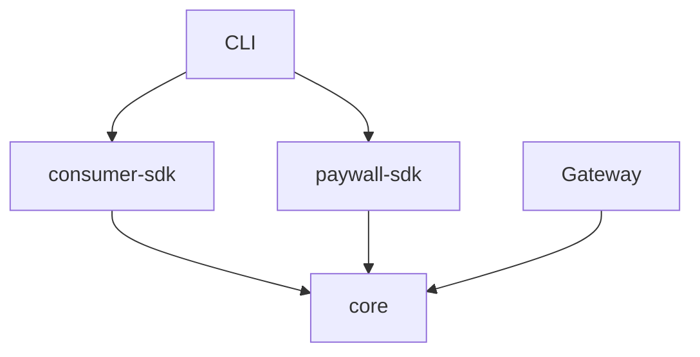

# AgentPayKit Monorepo Architecture

## 📦 Package Structure

AgentPayKit is now organized as a monorepo with separate packages optimized for different use cases:

```
agentpaykit/
├── packages/
│   ├── core/                    # Shared utilities (private)
│   ├── consumer-sdk/           # For API consumers  
│   └── paywall-sdk/           # For API providers
├── cli/                       # Command-line interface
├── gateway/                   # API gateway service
├── contracts/                 # Smart contracts
└── docs/                     # Documentation
```

## 🎯 Design Philosophy

**Separation of Concerns**: Each package serves a distinct user persona with optimized bundle sizes and focused APIs.

### 📊 Package Comparison

| Package | Purpose | Bundle Size | Target User |
|---------|---------|-------------|-------------|
| `@agentpay/consumer-sdk` | Consume APIs with payments | ~200KB | AI developers, trading bots |
| `@agentpay/paywall-sdk` | Monetize APIs with middleware | ~50KB | API providers, SaaS builders |
| `@agentpay/core` | Shared utilities | ~30KB | Internal use only |

## 🔗 Package Details

### 1. @agentpay/core (Private Package)

**Purpose**: Shared utilities, types, and smart contract interfaces.

**Key Exports**:
- Contract ABIs and addresses  
- Type definitions (PaymentOptions, WalletInfo, etc.)
- Crypto utilities (signature verification, hashing)
- Multi-chain configurations

**Files**: 
- `contracts.ts` (47 lines) - Contract configurations
- `types.ts` (128 lines) - Shared TypeScript interfaces
- `crypto.ts` (186 lines) - Payment verification utilities

### 2. @agentpay/consumer-sdk (Public Package)

**Purpose**: SDK for developers who want to call APIs with automatic payments.

**Key Features**:
- Universal wallet management (generate, import, connect)
- Smart account integration (Biconomy, ZeroDev, Alchemy)
- Automatic payment routing (balance → permit → smart account)
- Batch operations for efficiency
- Dual usage pattern (earn + spend)

**Main File**: `AgentPayKit.ts` (334 lines)

**Usage**:
```typescript
import { AgentPayKit } from '@agentpay/consumer-sdk';

const agentpay = new AgentPayKit();
const result = await agentpay.payAndCall('weather-api', { city: 'NYC' }, {
  price: '0.05'
});
```

### 3. @agentpay/paywall-sdk (Public Package)

**Purpose**: Express middleware for API providers to instantly monetize their APIs.

**Key Features**:
- One-line integration (`paywall.protect()`)
- Automatic payment verification
- Real-time analytics and revenue tracking
- Flexible per-route pricing
- Built-in health checks

**Main File**: `AgentPayWall.ts` (306 lines)

**Usage**:
```typescript
import { AgentPayWall } from '@agentpay/paywall-sdk';

const paywall = new AgentPayWall({ apiKey: 'your-key' });
app.use('/api', paywall.protect());
```

## 🔄 Inter-Package Dependencies



- **consumer-sdk** and **paywall-sdk** both depend on **core**
- **CLI** uses both consumer and paywall SDKs
- **Gateway** uses core utilities
- **No circular dependencies**

## 🚀 Development Workflow

### Install Dependencies
```bash
# Install all workspace dependencies
npm install

# Build all packages
npm run build
```

### Package Scripts
```bash
# Build specific package
cd packages/consumer-sdk && npm run build

# Watch mode for development
cd packages/paywall-sdk && npm run dev

# Run tests
npm test --workspaces
```

### Publishing
```bash
# Consumer SDK (public)
cd packages/consumer-sdk
npm publish

# Paywall SDK (public)
cd packages/paywall-sdk  
npm publish

# Core (private - not published)
```

## 📈 Growth Strategy

### Phase 1: Separate Package Discovery
- **Consumer developers** find `@agentpay/consumer-sdk` via NPM search
- **API providers** find `@agentpay/paywall-sdk` independently
- Clear value proposition for each package

### Phase 2: Cross-Pollination
- Consumer SDK users discover they can earn by providing APIs
- Paywall SDK users discover they can optimize costs by consuming APIs
- Network effects drive ecosystem growth

### Phase 3: Enterprise Adoption
- Enterprises install both packages for complete API economy
- Full-featured CLI for advanced operations
- White-label solutions based on core packages

## 🎯 User Journeys

### Consumer Journey
1. **Discovery**: "I need to call AI APIs" → Find `@agentpay/consumer-sdk`
2. **Installation**: `npm install @agentpay/consumer-sdk`
3. **First API call**: Generate wallet → Deposit balance → Call API
4. **Optimization**: Discover smart accounts, batch operations
5. **Expansion**: Register own APIs to earn while spending

### Provider Journey  
1. **Discovery**: "I want to monetize my API" → Find `@agentpay/paywall-sdk`
2. **Integration**: Add `paywall.protect()` to Express routes
3. **First payment**: User pays → Automatic verification → Start earning
4. **Growth**: Analytics → Optimize pricing → Scale revenue
5. **Expansion**: Use earnings to consume other APIs

## 🔧 Technical Benefits

### Bundle Optimization
- **No unused code**: Consumers don't download paywall logic
- **Faster installs**: Smaller packages install quicker
- **Better caching**: npm can cache packages independently

### Development Velocity
- **Parallel development**: Teams can work on packages independently
- **Independent releases**: Update consumer SDK without affecting paywall SDK
- **Clear boundaries**: Easier testing and debugging

### Ecosystem Growth
- **SEO optimization**: Each package optimized for different search terms
- **Clear documentation**: Focused docs for each use case
- **Viral growth**: Users naturally discover the other package

## 📊 Success Metrics

### Package-Specific KPIs
- **Consumer SDK**: API calls/day, wallet generations, balance deposits
- **Paywall SDK**: API registrations, revenue generated, middleware installations
- **Core**: Adoption across packages, stability metrics

### Ecosystem KPIs
- **Cross-package adoption**: Users with both packages installed
- **Network effects**: Revenue flowing between package users
- **Enterprise adoption**: Large-scale deployments

## 🛡️ Maintenance Strategy

### Versioning
- **Semantic versioning** for all public packages
- **Coordinated releases** for breaking changes
- **Independent patches** for bug fixes

### Documentation
- **Package-specific READMEs** with focused examples
- **Cross-package guides** showing integration patterns
- **Migration guides** for major version updates

### Support
- **GitHub Issues** with package labels
- **Discord channels** for each package
- **Unified CLI** for troubleshooting

---

This architecture provides the foundation for sustainable growth while maintaining developer experience and bundle optimization. Each package serves its specific purpose while contributing to the larger AgentPayKit ecosystem. 